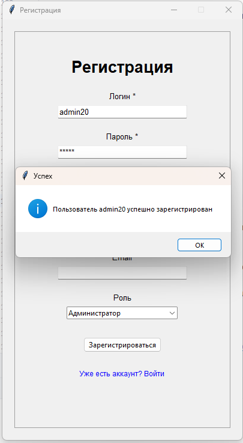
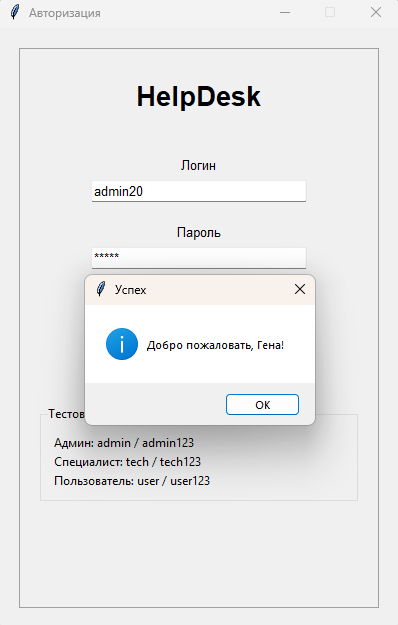
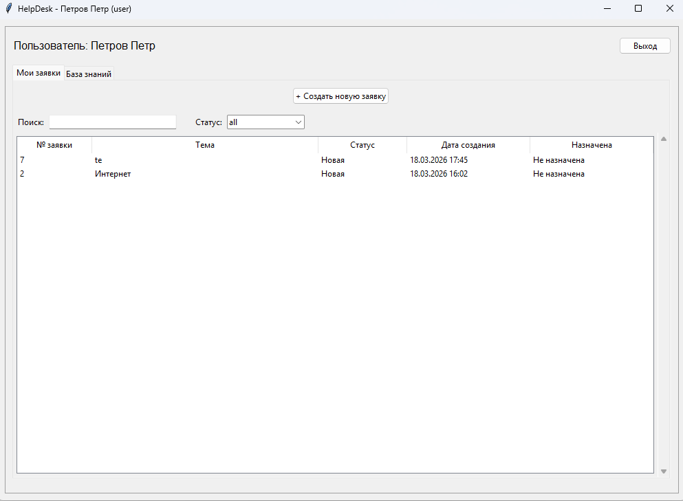
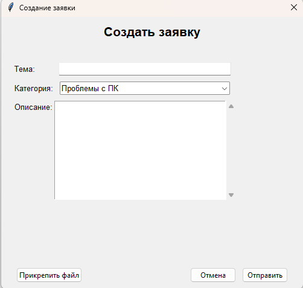
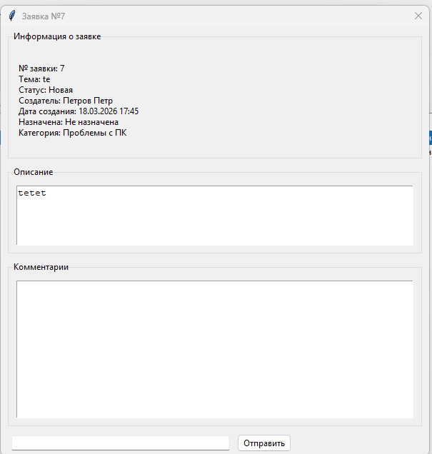
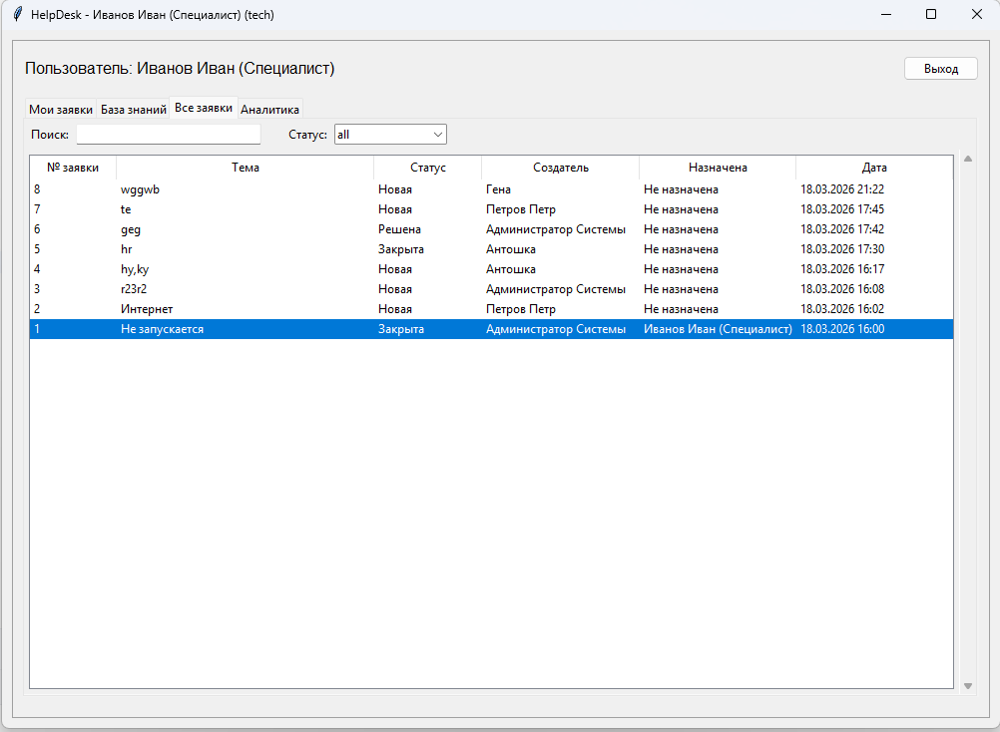
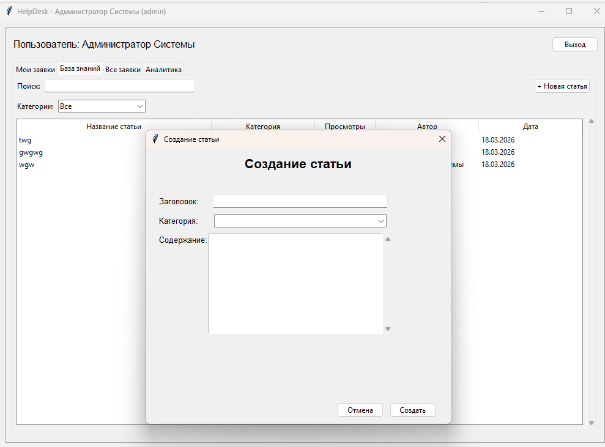
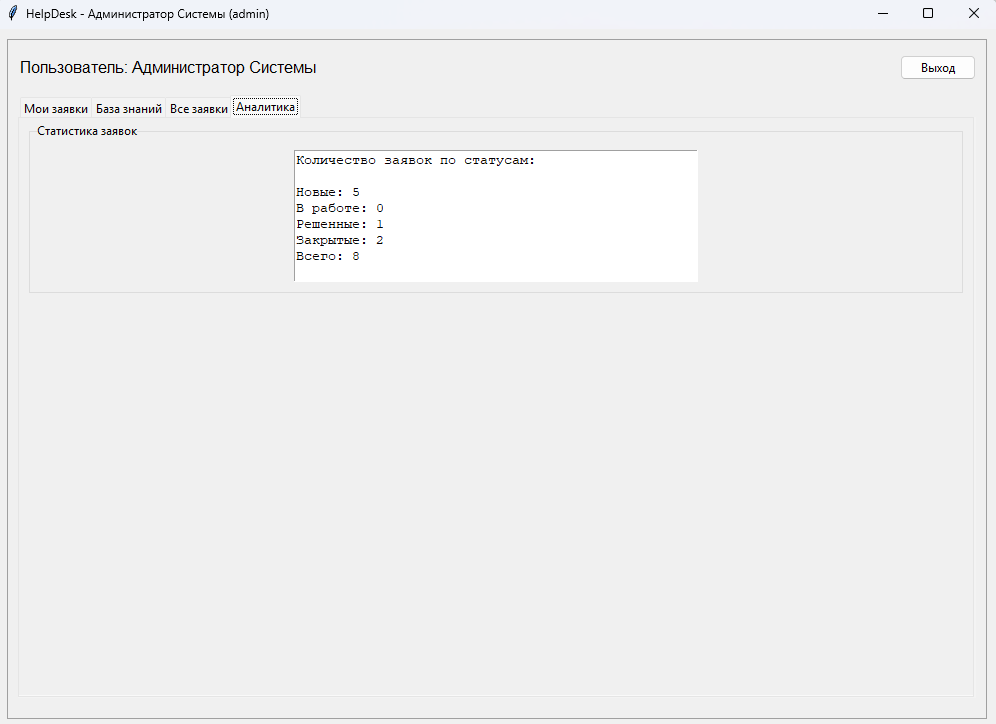

# Информационная система «Техническая поддержка»
## Наименование проекта
Полное наименование: **Информационная система «Техническая поддержка» (HelpDesk).**  
Краткое наименование: **ИС «TechSupport».**

---
### Структура проекта
```
HelpDesk/
|-- Connection/
|   |-- connect.py
|-- Controller/
|   |-- AnalyticsController.py
|   |-- CategoryController.py
|   |-- CommentsController.py
|   |-- KnowledgeController.py
|   |-- TicketsController.py
|   |-- UserController.py
|-- Models/
|   |-- Base.py
|   |-- Categories.py
|   |-- Comments.py
|   |-- create_table.py
|   |-- Knowledgebase.py
|   |-- Tickets.py
|   |-- Users.py
|-- View/
    |ArticleDetail.py
    |AuthView.py
    |CreateArticle.py
    |Home.py
    |Registration.py
    |SelectTech.py
    |Ticketdetailwindow.py
|-- main.py
|-- library.txt
```

---
### Технологии
- **Python**
- **Tkinter**
- **Peewee**
- **MySQL**
- **PyMySQL**


---
## Установка
1. Установить зависимости:
```bash
pip install -r library.txt
```
2. Настроить подключение к локальной БД в `Connection/connect.py`.
3. Создать таблицы в БД:
```bash
python Models/create_table.py
```
4. Запуск приложения:
```bash
python main.py
```

---
## Руководство пользователя  ##
Информационная система службы технической поддержки

### Содержание

1. Работа пользователя

2. Как создать заявку

3. Как отследить статус заявки

4. Работа специалиста

5. Как взять заявку в работу

6. Как изменить статус заявки

7. Как комментировать заявки

8. База знаний

9. Как искать ответы на вопросы

10. Как добавлять статьи

11. Отчеты (для администратора)
---
# Для входа в систему:

- Введите Логин в соответствующее поле

- Введите Пароль в соответствующее поле

- Нажмите кнопку "Войти"
### Тестовые учетные записи:
- Роль	        Логин	  Пароль
- Администратор	admin	admin123
- Специалист	tech	tech123
- Пользователь	user	user123
### Регистрация нового пользователя
- Если у вас нет учетной записи:

- Нажмите ссылку "Нет аккаунта? Зарегистрироваться"

- Заполните все обязательные поля (отмечены *):

- Логин

- Пароль (не менее 4 символов)

- Подтверждение пароля

- ФИО

- Выберите роль из выпадающего списка

- Нажмите кнопку "Зарегистрироваться"


- При успешной регистрации вы будете автоматически перенаправлены в окно авторизации:


---

1. Работа пользователя

После успешного входа открывается главное окно приложения.

Для пользователя доступны две вкладки:

- "Мои заявки" - список созданных пользователем заявок

- "База знаний" - статьи и инструкции




---
2. Как создать заявку
- В главном окне нажмите кнопку "+ Создать новую заявку"
- В открывшемся окне заполните форму:



- Тема - краткое описание проблемы

- Категория - выберите из выпадающего списка

- Описание - подробное описание проблемы

- При необходимости нажмите "Прикрепить файл" (функция в разработке)

- Нажмите кнопку "Отправить" для создания заявки

- Нажмите "Отмена" для закрытия окна без сохранения

- После успешного создания заявка появится в списке "Мои заявки" с присвоенным номером.

---

3. Как отследить статус заявки 

В главном окне на вкладке "Мои заявки" отображается таблица со всеми вашими заявками:

Статусы заявок:
- Новая	    
- В работе	
- Решена	    
- Закрыта	    

Поиск и фильтрация:

Поиск - введите ключевые слова в поле поиска для фильтрации по теме или описанию

Фильтр по статусу - выберите нужный статус из выпадающего списка


Просмотр деталей заявки:

Для просмотра подробной информации дважды кликните по нужной заявке в таблице. Откроется окно с деталями:



В этом окне вы можете:

- Просмотреть полное описание заявки

- Увидеть, кто назначен исполнителем

- Читать комментарии специалистов

- Видеть историю изменений статуса

Добавление комментариев:

- В окне деталей заявки введите текст в поле "Комментарий"

- Нажмите кнопку "Отправить"

- Ваш комментарий появится в списке

Примечание: обычные пользователи могут оставлять только публичные комментарии. Приватные комментарии (для специалистов) им недоступны.

---
4. Работа специалиста

Специалист имеет расширенный функционал по сравнению с обычным пользователем. Доступны следующие вкладки:

- "Мои заявки" - заявки, назначенные данному специалисту

- "Все заявки" - все заявки в системе

- "База знаний" - статьи (с возможностью создания)

- "Аналитика" - статистика по заявкам



---
5. Как взять заявку в работу
Способ 1 (если заявка уже назначена):

- Заявки, назначенные на вас, автоматически отображаются во вкладке "Мои заявки"

Способ 2 (для администратора или при самоназначении):

- Откройте вкладку "Все заявки"

- Найдите нужную заявку (можно использовать поиск или фильтр)

- Дважды кликните по заявке для открытия деталей

- Нажмите кнопку "В работе" в панели изменения статуса

---
6.Как изменить статус заявки
В окне деталей заявки доступны кнопки для изменения статуса:

Доступные статусы:

Новая → В работе - начало обработки заявки

В работе → Решена - проблема решена, ожидает подтверждения

Решена → Закрыта - завершение заявки

В работе → Новая - возврат в очередь (при необходимости)

Для изменения статуса нажмите соответствующую кнопку. 

Статус изменится мгновенно, и заявка обновится в списках.

---
7.Как комментировать заявки
Специалисты могут оставлять два типа комментариев:

Публичные комментарии - видны всем пользователям
Приватные комментарии - видны только специалистам и администраторам


Добавление комментария:

В окне деталей заявки введите текст в поле "Комментарий"

Установите флажок "Приватный" если комментарий предназначен только для специалистов

Нажмите кнопку "Отправить"

Приватные комментарии в списке помечаются тегом [ПРИВАТНЫЙ].

Назначение специалиста (только для администратора):


В окне деталей заявки нажмите кнопку "Назначить специалиста"

В открывшемся окне выберите специалиста из списка

Нажмите "Назначить"

При назначении статус заявки автоматически меняется на "В работе".

---
8.База знаний
База знаний доступна всем пользователям системы. Для специалистов и администраторов также доступно добавление новых статей.

---
9.Как искать ответы на вопросы
Способ 1: Поиск по статьям

В главном окне перейдите на вкладку "База знаний"

В поле поиска введите ключевые слова

Система отобразит статьи, содержащие эти слова в заголовке или содержании

Способ 2: Фильтрация по категориям

На вкладке "База знаний" выберите категорию из выпадающего списка

Отобразятся только статьи выбранной категории

Способ 3: Просмотр популярных статей

В главном окне нажмите кнопку "База знаний (Вопрос-Ответ)"

Откроется специальное окно для поиска ответов на вопросы

В нижней части окна отображаются "Популярные вопросы"

Кликните по вопросу для автоматического поиска ответа

Поиск ответа на вопрос:

В окне "База знаний (Вопрос-Ответ)" введите ваш вопрос в текстовое поле

Нажмите кнопку "Найти ответ"

В поле "Ответ" отобразится найденная информация или сообщение "Данные в Базе Знаний отсутствуют"

---
10.Как добавлять статьи

Добавление статей доступно для специалистов и администраторов.

Добавление обычной статьи:

- В главном окне перейдите на вкладку "База знаний"

- Нажмите кнопку "+ Новая статья"

- В открывшемся окне заполните:

- Заголовок - название статьи

- Категория - выберите из списка

- Содержание - текст статьи

- Нажмите "Создать"



Добавление вопроса-ответа (для администратора):

В главном окне нажмите кнопку "База знаний (Вопрос-Ответ)"

Перейдите на вкладку "Добавить вопрос"

Заполните поля:

Вопрос - текст вопроса

Ответ - подробный ответ

Нажмите "Добавить в базу знаний"

Управление вопросами-ответами (для администратора):

В окне "База знаний (Вопрос-Ответ)" перейдите на вкладку "Управление"

Отобразится список всех вопросов

Вы можете:

Редактировать - изменить вопрос или ответ

Удалить - удалить вопрос из базы знаний

Обновить список - обновить отображение

---

11. Отчеты (для администратора)
Администратору доступна вкладка "Аналитика" с базовой статистикой по заявкам.

Просмотр статистики
В главном окне перейдите на вкладку "Аналитика"

Отобразится статистика по заявкам:



Отображаемая информация:

- Количество Новых заявок

- Количество заявок В работе

- Количество Решенных заявок

- Количество Закрытых заявок

Общее количество заявок

Управление пользователями (только для администратора)
Администратор может управлять пользователями системы:

В главном окне перейдите на вкладку "Пользователи" (если добавлена)

Отобразится список всех зарегистрированных пользователей

Доступные действия:

Поиск пользователей по логину, ФИО или email

Добавление нового пользователя

Редактирование данных пользователя

Изменение роли пользователя

Удаление пользователя


---

## Лицензия
***Проект учебный, находится в разработке в рамках практического задания.Использование и доработка для учебных целей разрешены.***


